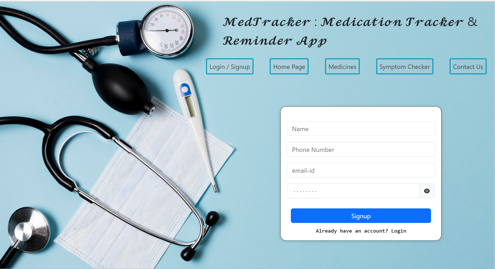
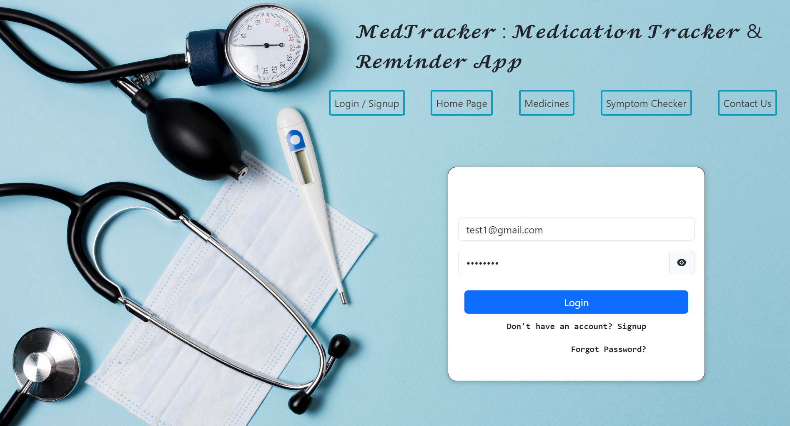
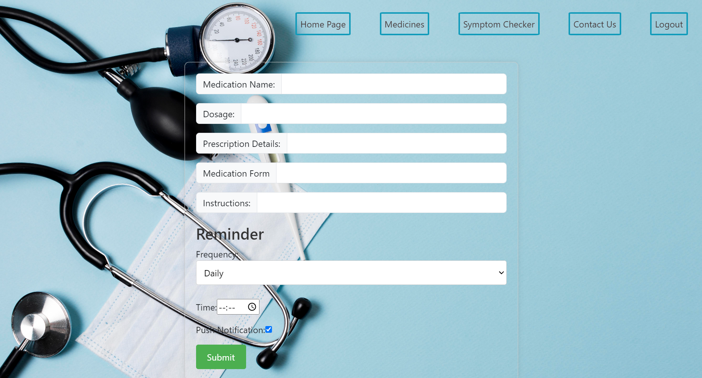
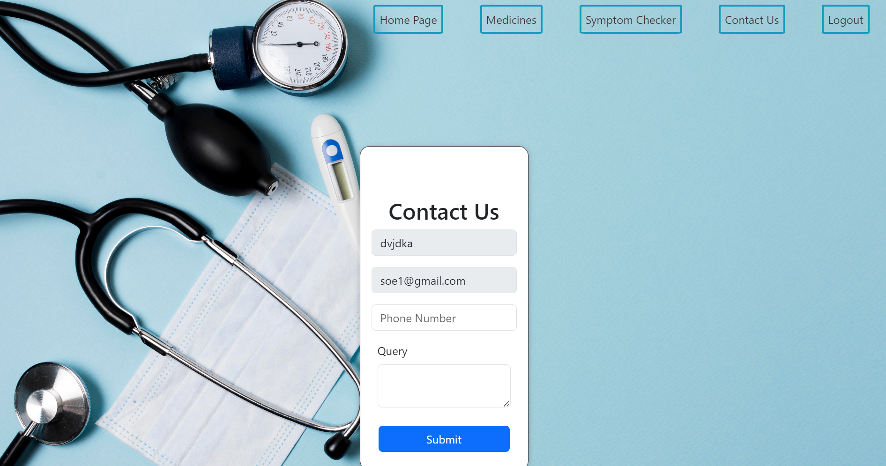

MedTracker: Medication Tracker & Reminder App
MedTracker is an application designed to make managing your medication schedule easy and stress-free. Whether you're juggling multiple medications or just need a reminder to take your vitamins, we've got you covered. 
Link : https://6574a67a13a6c807e22b7957--sprightly-pavlova-5427e8.netlify.app/
Contributors: 
1.	Ayush Gupta
2.	Pushkar Gupta
3.	Rachit Jain

User Guide:
Sign Up:
 
Login:
 
How to Add your Medication: 

Notification Permission:
 
Search for Medicines:

Contact Us:

